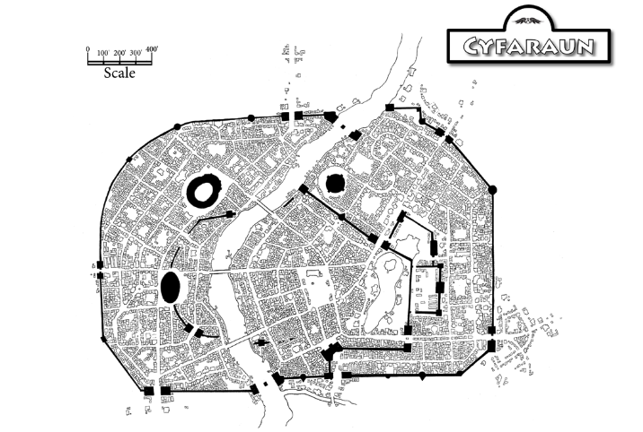

public:: true

- 
- Cyfaraun es la capital de la prefectura de las Tierras Fronterizas de Címbar, en [[Khessenta]]. Era una ciudad élfica hasta que [[Unzher]] la tomó tras la extinción del Bajo Imáskar, quedando liberada tras la independencia de Khessenta como parte de los dominios de Címbar. Mucha arquitectura élfica es aún visible en los viejos distritos de la ciudad. Como la mayoría de grandes ciudades de Khessenta, Cyfaraun tiene un gran sistema de cloacas, pero las cloacas de Cyfaraun son inusuales porque se construyeron a partir de las ruinas de una ciudad élfica aún más antigua. Los bardos locales claman que la arquitectura subterránea de la ciudad abarca de todo, desde catacumbas antiguas hasta templos demoníacos y escondrijos criminales. Los residentes de la ciudad tienden a decir que esos bardos tienen la boca tan sucia como las cloacas de las que hablan.
- 
- # Distritos de Cyfaraun
- La ciudad de Cyfaraun está dividida en ocho distritos administrativos numerados (*nomos*):
	- Distrito Viejo
	- Distrito Festival
	- Distrito Puente
	- Distrito Plaza
	- Distrito de la Torre
	- Distrito de los Templos
	- Distrito del Lago
	- Distrito de Palacio
- A pesar de que los Cimbaritas prefieren una disposición cuadriculada con barrios cuidadosamente separados, la larga historia y la peculiar geografía de Cyfaraun han resultado en que los barrios tengan formas extrañas y estén separados por límites casi aleatorios. La Muralla Imperiale (construids por los Cimbaritas) circunvalan los ocho distritos, mientras que los comúnmente llamados Muros Viejos (construidos por los elfos) forman un cinturón interior que rodea al Distrito Viejo y el Distrito Puente. Las murallas interiores construidas para proteger los edificios de gobierno en el Distrito de Palacio se conocen como Murallas Prefecturales.
- ## Nomos I – Distrito Viejo
- El distrito más densamente poblado de la ciudad, abarca casi la totalidad de la vieja Cyfaraun. Su frontera con el Distrito Puente está marcada por la Cesta Mirmen Gollë ("Calle Aguanegra del Este"), mientras que su frontera con el distrito del Lago es la Cesta Tirenium ("Calle Capital"). Los Muros Viejos al noreste la separan de los distritos de la Torre y de Palacio, con la Pylos Aurigëus ("Puerta del Patricio") como pasaje entre ellos. Destacan como lugares prominentes el Cuartel de la Guardia de la Ciudad, el Emporium, la Cofradía de Mercaderes, la Cofradía de Mercenarios y El Visón. El Distrito Viejo está densamente poblado por artesanos, trabajadores, tenderos, taberneros y comerciantes, y por supuesto por rameras, matones y vagabundos.
- ## Nomos II – Distrito Festival
- El Distrito Festival recibe este nombre por las frecuentes celebraciones y juegos llevados a cabo en el Anfiteatro Imperial. El distrito se extiende hacia el oeste desde el banco oeste del Río Mirmen, con la Muralla Imperial marcando el límite al noroeste, donde la Pylos Vandelus ("Puerta de los Viajeros") da acceso a las calzadas del norte. La intersección de las líneas de Cesta Gundan ("Calle de los Lobos") y Cesta Nuviën ("Calle de las Rosas") dibuja la frontera con el Distrito Plaza al suroeste. Tradicionalmente el borde sureste del Distrito Festival eran los Muros Viejos, pero con el último censo fue modificado para incorporar un bloque del Distrito Puente que había quedado habitado mayormente por actores, trabajadores del anfiteatro y otros residentes del ámbito festivo. Como lugares prominentes destacan la Fila de los Jugadores, la Posada del Poni Sedoso y las escuelas de gladiadores de Omnus Pluris, Celictor Nuvicus y Maximus Arjentüran. Hay numerosas plazas moteando el distrito, donde ferias callejeras, mimos y músicos aparecen a diario.
- ## Nomos III - Distrito Puente
- Los tres grandes puentes que abarcan el Río Mirmen dan nombre a este distrito. El Pontos Orëan ("Puente Norte") y Pontos Vothëan ("Puente Sur") fueron construidos por Unzher tras la guerra contra Imaskar pero el Pontos Myrdin ("Puente de Myrdin") que está en medio es un legado de los elfos, llamado así por el heroico hojaconjuros que murió defendiéndolo. Al este de los puentes, el distrito queda adyacente al Distrito Viejo a lo largo de la Cesta Mirmen Gollë ("Calle Aguanegra del Este"). Al sur, termina en el Pyros Ivor Vothë ("Puerta del Río Sur"). Aparte del Pontos Myrdin, el monumento más impactante es el masivo Ammontürium ("Ciudadela Solar"), una gran estructura abovedada erigida para alabar a Amaunator por dar la victoria en las guerras de Címbar. El Distrito Puente una vez acababa en los Muros Viejos que llegan hasta la Ciudadela Solar, pero mucho del personal eclesiástico y secular de la Ciudadela Solar han hecho sus residencias en los bloques vecinos directamente al sur, por lo que los límites fueron redibujados en el último censo. El Pylos Ammon ("Puerta Solar") controla el tráfico a través de los muros.
- ## Nomos IV – Distrito Plaza
- El Distrito Plaza toma su nombre por las muchas arcadas y plazas que hay en el bloque. Estas son mayormente comerciales y sirven como lugares especializados que reducen las aglomeraciones en el Emporium. El Distrito plaza bordea al oeste y el sur con la Muralla Imperial, que se extienden desde el Pylos Tellë ("Puerta Oeste") a la Pylos Pumilos ("Puerta de la Plaza") siguiendo hasta la Pylos Ivor Vothë ("Puerta del Río Sur"). Las líneas de intersección de la Cesta Gundan ("Calle de los Lobos") y Cesta Nuviën ("Puerta de las Rosas") delimitan el borde con el Distrito Festival al noreste. La frontera