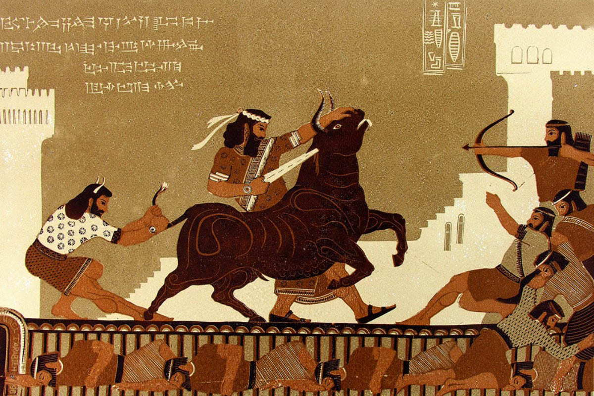
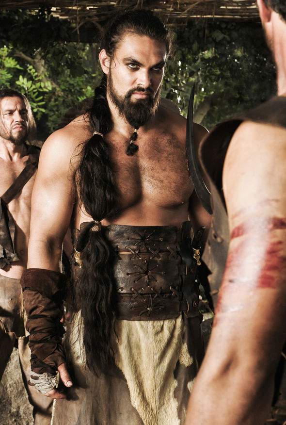

public:: true

- 
- 
- El tiránico rey-dios de [[Unzher]].
- En épocas pretéritas derrotó al imperio de Imaskar junto a su panteón y el panteón Mulhorandino. Estos dioses escogieron caminar sobre la faz de Faerûn en lugar de ascender a un mundo superior, por lo que quedaron gobernando las regiones que habían conquistado. El panteón Unzhérico, al que Gilgeam pertenece, fue diezmado durante la guerra contra los Imaskari. Muchos de los otros dioses perecieron o abandonaron Toril con el tiempo hasta que solo quedaron unos pocos. Cuando Enlil, el padre del panteón Unzhérico, abandonó Toril (año -734 CV) Gilgeam se convirtió en dios-rey de Unzher.
- En algún momento, Gilgeam enloqueció mientras su imperio decaía. Desde entonces, gobierna la región con puño de hierro.
- Maestro de las guerras, padre de la victoria, dios del cielo y las ciudades, gobernante supremo de Unzher, Khessenta, Zhreskel, Khondath, Turmish, Sheír y el Bosque Yuir.
- **Símbolo**: Un puño rojo respaldado por un sol dorado sobre un fondo negro.
- Los sacerdotes de Gilgeam deben obedecer a su señor sin cuestionarlo. Deben hacer cumplir su voluntad. Deben matar a sus enemigos. Deben perseguir a todos los que no lo adoren. Deben herir a los enemigos de Unzher.
- Gilgeam es el líder supremo de los dioses de Unzher (los pocos que quedan) y gobernante de la tierra. Su manifestación vive en Unzhalass y ha salido de la ciudadela muchas veces para golpear a sus enemigos con poder divino. Es un dios conocido por sus celos, crueldad y orgullo; es codicioso de riquezas y grava pesadamente a la gente.
- El propio Gilgeam es un dios de la destreza física; Si un guerrero de gran fuerza y ​​capacidad de lucha es capturado, Gilgeam le ofrecerá libertad si el guerrero puede derrotarlo en un combate de lucha libre. Entonces Gilgeam lo matará con sus propias manos.
- Gilgeam no tiene encarnaciones, aunque sólo sea porque una encarnación de Gilgeam podría estar llena del sentido de justicia y honor que él mismo perdió hace mucho tiempo. Gilgeam tampoco tiene herederos, aunque disfruta de la compañía de mujeres (un hijo podría resultar una amenaza para la seguridad de su trono).
- El culto a Gilgeam es el más poderoso de Unzher, aunque sólo sea porque pocos otros cultos están permitidos. Los ídolos de Gilgeam deben decorar cada esquina y cada hogar, y aquellos que desfiguran su imagen morirán. Gilgeam es un hombre alto, hermoso y muy musculoso con cabello y barba largos y dorados. Normalmente viste túnicas reales, pero va a la batalla con su maza y una falda de bronce que cubre la parte inferior del torso y la parte superior de las piernas.