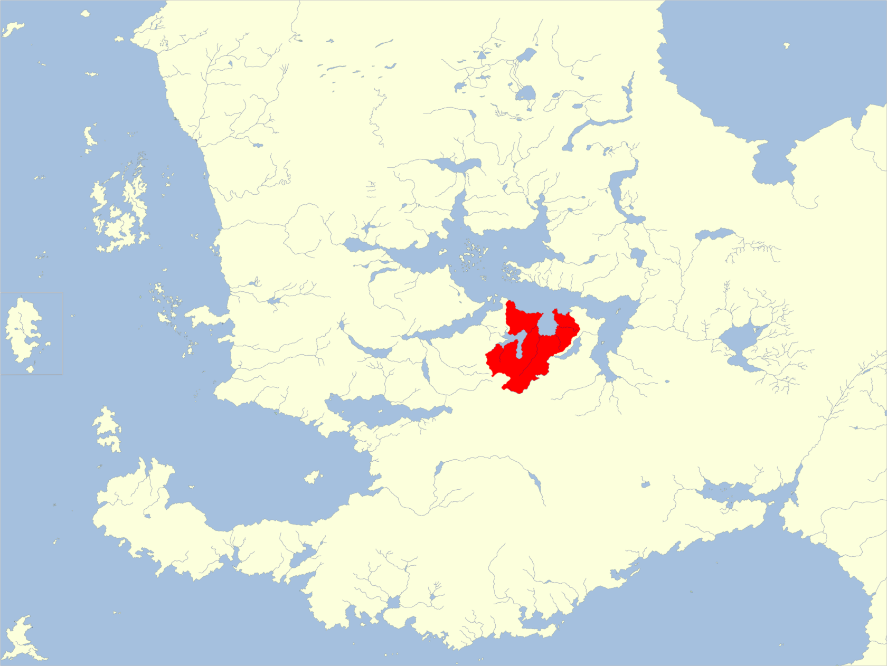

- > En Khessenta, la gente es incapaz de vivir una vida tranquila, o de permitir a otros hacerlo.
  > — *Heptios, el Archimago*
- ## Mapas
- 
- 
- ## Resumen
- **Capital:** Címbar (teóricamente)
- **Población:** 3.386.880 (humanos 90%, medianos 4%, enanos 3%, semiorcos 2%, hombres lagarto 1%)
- **Gobierno: **varía según la ciudad (régimen militar, teocracia, monarquía)
- **Religiones:** [[Amaunator]], [[Nephthys]], [[Ishtar]], [[Savras]], [[Valkur]], [[Tyr]], [[Tkhazzar]], [[Vhaukin]], [[Yérgal]].
- **Importaciones:** armas, caballos, cristal, esclavos, mercenarios, perfumes, ganado porcino, queso
- **Exportaciones:** aceite de oliva, armas, arte, esclavos (para [[Zhay]]), estatuas, ganado vacuno, hierro de calidad, oro plata, uvas, vino
- ---
- Khessenta, un grupo de ciudades consideradas una sola nación por el resto de [[Faerûn]], es de todo menos un lugar unido. Las ciudades guerrean entre sí por culpa de viejos desaires, diferencias filosóficas o influencias económicas. Las compañías de aventureros y mercenarios se ganan bien la vida aquí, contratados por diversos gobiernos para realizar ataques furtivos, planes estratégicos o facilitar protección. La cultura de Khessenta está obsesionada con el conflicto físico, teniéndose en muy alta estima a los héroes de guerra. La nación es amistosa con los enanos, pero se siente incomoda con los elfos. Los khessentanos aprecian las artes y son muy aficionados al teatro; la profesión de bardo sólo es superada en seguidores por la de guerrero.
- [[Unzher]] y [[Mulhorand]] son sociedades relativamente estables y unidas, y la estructura social no varía demasiado de región a región. En Khessenta esto no es el caso; cada ciudad es una sociedad diferente y puede albergar diferencias sustanciales en la composición social, leyes y carácter. Las gentes de Khessenta son de muchas etnias: Los humanos más comunes son los Mulan (de Unzher/Mulhorand), los Turami (de Turmish), los Rashemíes (de Rashemen) y los Amnitas (de Amn); hay también más de unos cuantos elfos, orcos y enanos mezclados en las ciudades. Las ciudades de Airspur y Mordulkin son particularmente reconocidas por su mezcla cosmopolita de razas.
- Como en las otras dos regiones de los [[Antiguos Imperios]] , hay tres clases sociales: nobleza, clase media y esclavos o siervos. Los gobernantes son normalmente humanos Mulan, descendientes originales de aquellos que se rebelaron contra Unzher.