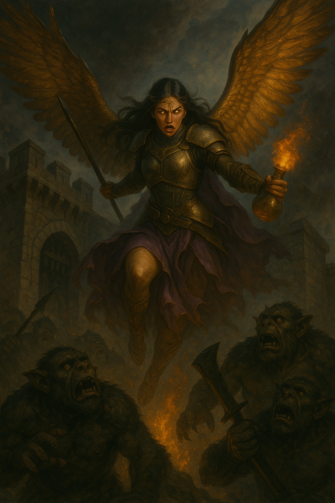
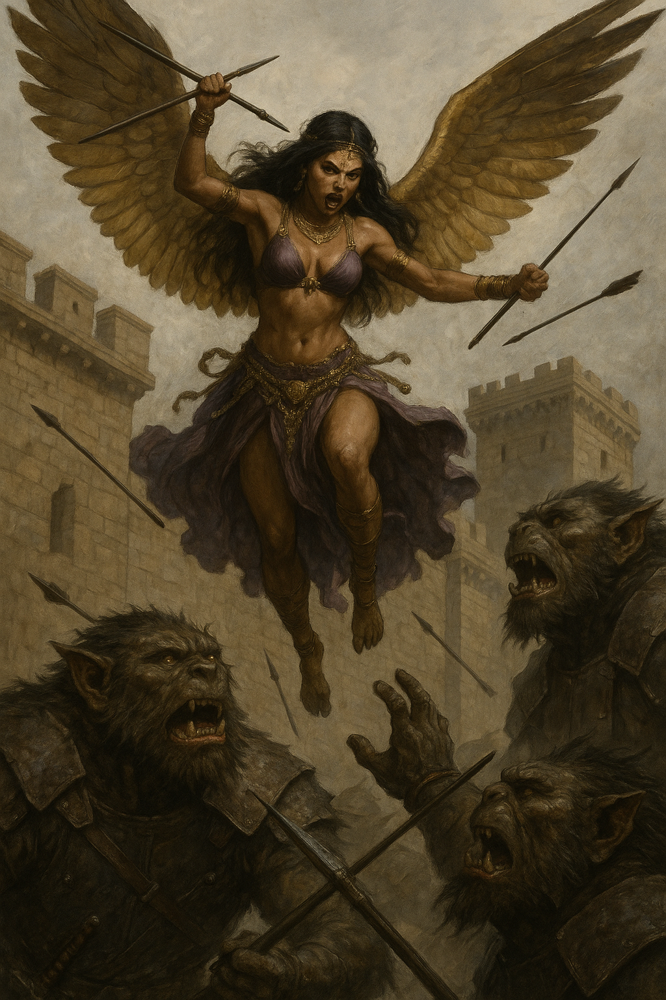
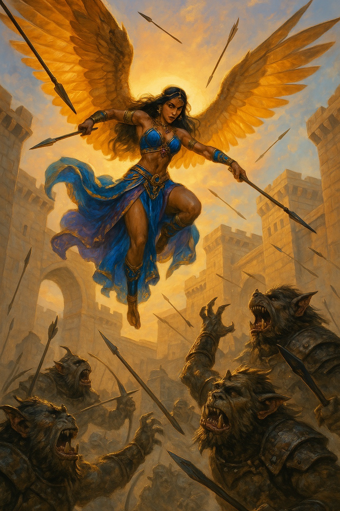
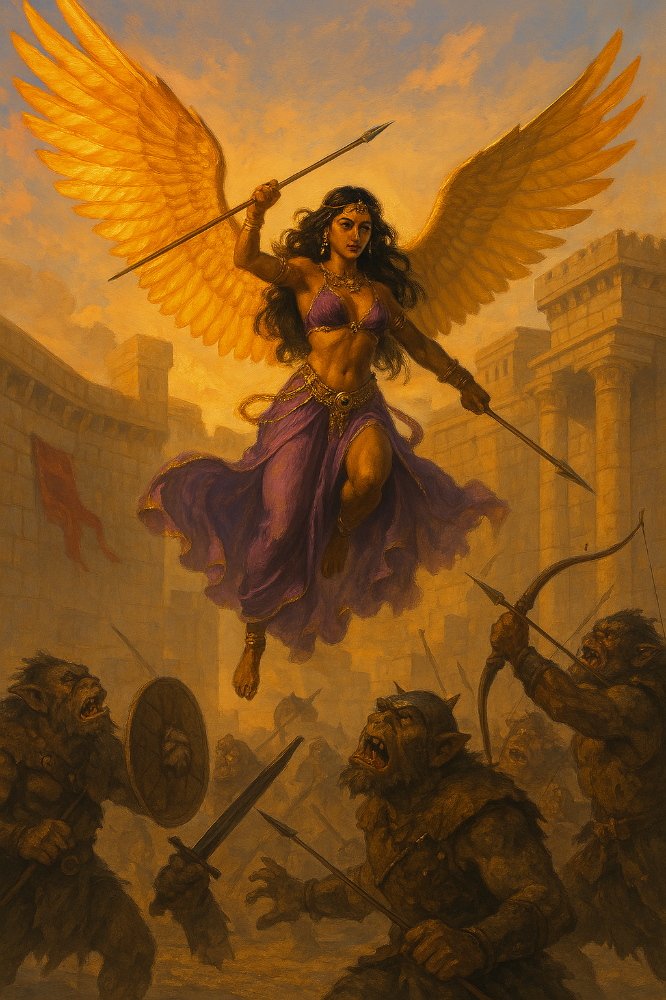

public:: true

- ## Sacrificio de [Astra]([[Astra, el guardián de la bóveda enano (RIP)]]) y [Shamash]([[Shamash-Nasir, el cruzado de Amaunator]]) en la primera batalla
- 
- ## [Nari]([[Nari, la hojadanzante de Ishtar]]) cayendo sobre los osgos en venganza
- De menos idealizada a más:
- 
- 
- {:height 1175, :width 778}
- 
- 
-