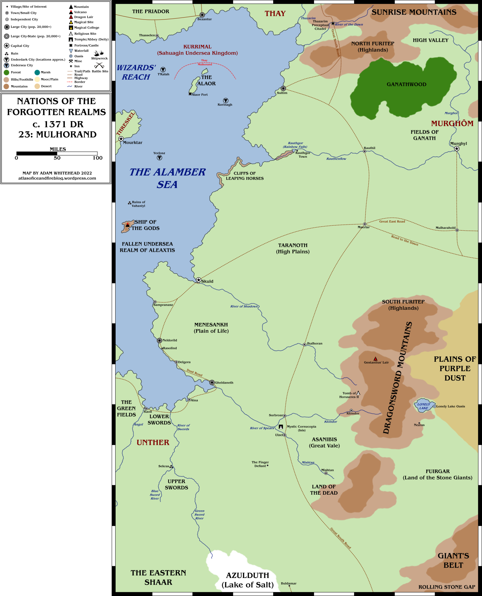
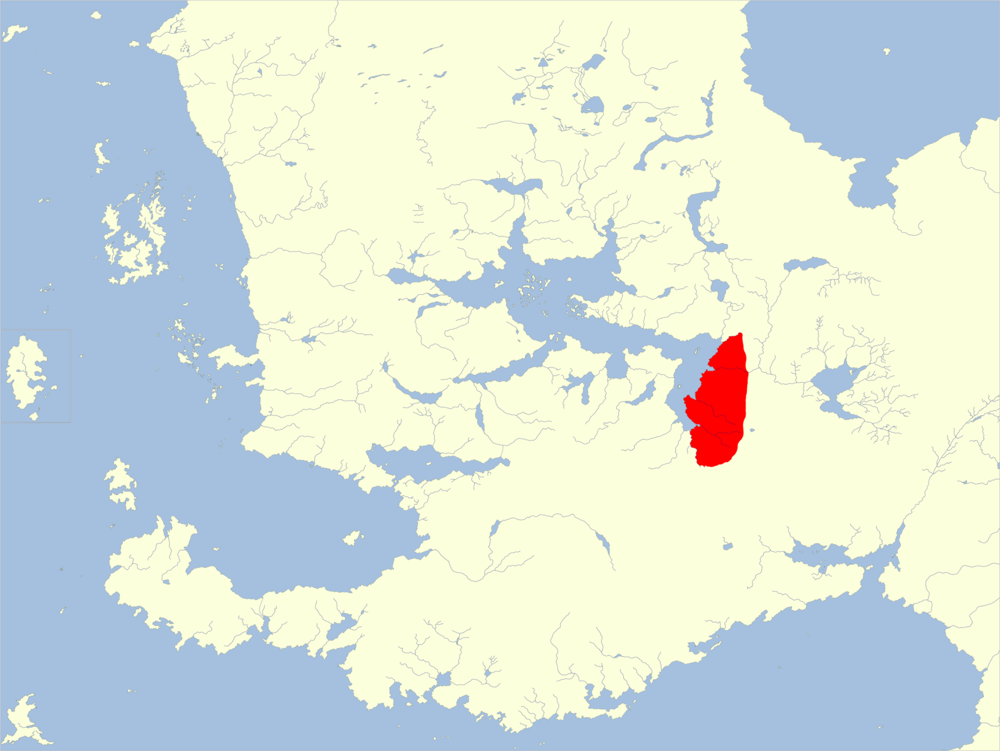

## Mapas
- 
- 
- ## Resumen
- **Capital:** Skuld
- **Población:** 5.339.520 (humanos 99%)
- **Gobierno: **teocracia
- **Religiones:** panteón mulhorandino
- **Importaciones:** esclavos (de [[Zhay]]), especias, hierro, incienso, buena madera de construcción, perfumes
- **Exportaciones:** cerveza, granito, libros de conjuros en blanco, oro, papel, piedras preciosas.
- ---
-