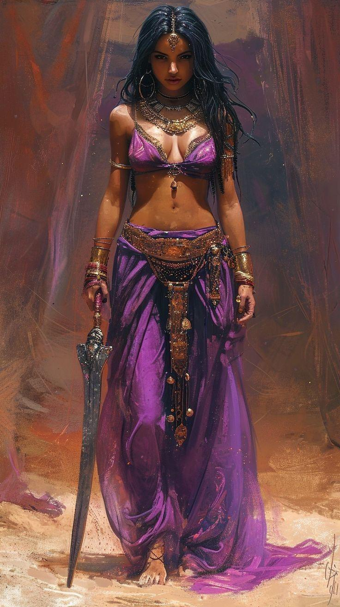

public:: true

- {:height 963, :width 536}
- **All images are the property of their respective owners**.
- ## Secuaces a su servicio
- [[Zia]], hojadanzante de Ishtar khessentana.
- [[Ralmevik]], berserker rashemí.
- ## Mercenarios a su servicio
- 28 berserkers rashemíes (infantería pesada, bárbaros nv. 1)
- 8 líderes berserker rashemíes (infantería pesada, bárbaros nv. 2)
- 10 peregrinas de Ishtar ()