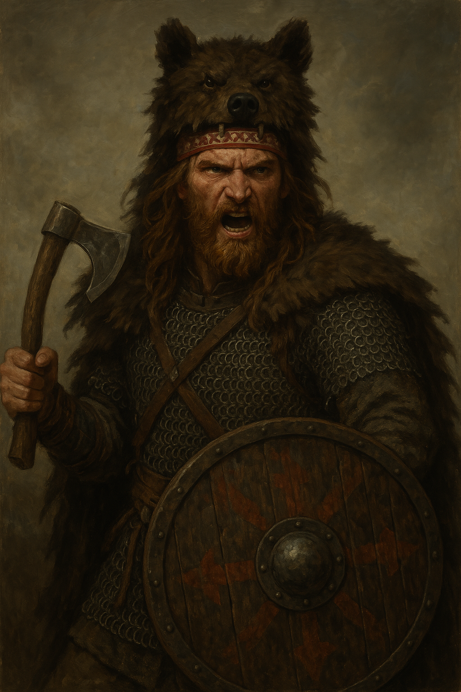
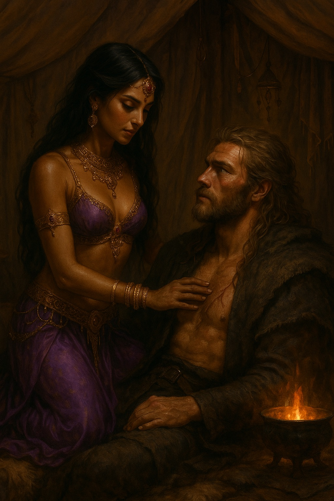

public:: true

- 
- 
- Líder de una banda de *bersérkers* procedentes de [[Rashemen]] que viajaron a las tierras del sur —"*allá lejos, donde el sol es inclemente*"— para probar su valía en la batalla.
- Es un fiero guerrero, pero también trae el conocimiento de la medicina de las brujas de Rashemen, útil para tratar envenenamientos y enfermedades.
- Ha quedado *embrujado* por [[Nari, la hojadanzante de Ishtar]], en más de un sentido.
- 
-
- ## Estadísticas
- Lealtad: +2 (temporal)