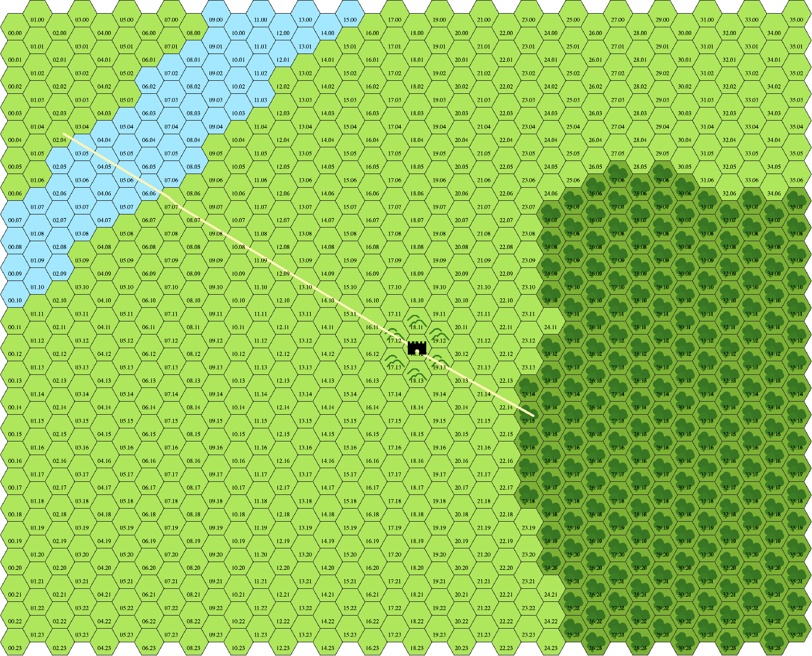

public:: true

- 
- Hexfriend file: [Türos Lilium.hexfriend](../assets/Türos_Lilium_1740438238727_0.hexfriend)
- Datos: [Google Spreadsheets link](https://docs.google.com/spreadsheets/d/103YZc9nS9LNmDQWMcBCeQTLyABX5qjXUpsJNsLT3MEk)
- ## Personalidades de la guarnición
- [[Arcadius]], capitán de la guardia.
- [[Solutor]].
- [[Ummash]], explorador.
- ## Guarnición
- 32 infantería ligera.
- 24 arqueros.
- ## Historia
- [[La batalla de Türos Lilium]]