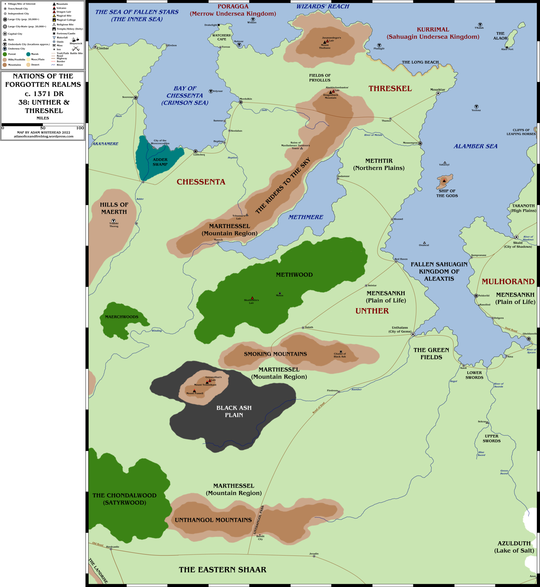
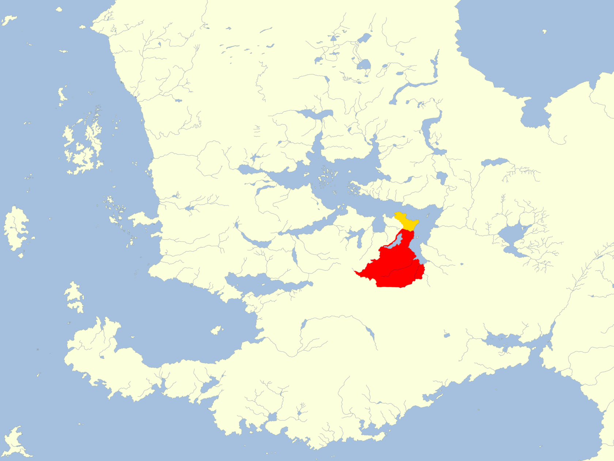

## Mapas
- 
- 
- ## Resumen
- **Capital:** Unzhalass
- **Población:** 4.263.840 (humanos 99%)
- **Gobierno: **teocracia directa
- **Religiones:** [[Gilgeam]], panteón unzhérico
- **Importaciones:** alimentos, armas, esclavos, mercenarios
- **Exportaciones:** aceite de semillas, cerámica, escultura, hierro, minerales, oro, tela
  
  Únzher, que en su día fue un gran imperio como su nación hermana de Mulhorand, sufre bajo el gobierno de la cruel manifestación de la deidad Gilgeam. Aún así, Únzher es una tierra de oportunidades, donde la fuerza militar, la diplomacia, el subterfugio y la intriga juegan un papel importante en la supervivencia y el poder.
  
  ---
  
  Las gentes de Unzher se dividen en varios grupos étnicos. El más común es el Mulan, que también es la raza de los dioses-reyes de Mulhorand. Este grupo huyó de su civilización original en el Raurin y se asentó alrededor de mar de Alamber. Los Mulan de esta región desplazaron de esta tierra a los hombres bestia (orcos, trasgos), otros humanoides y a los aborígenes humanos, los Turami. Muchos de estos últimos fueron recogidos por Mulhorand, donde fueron responsables de muchos de los grandes logros de esa cultura.
  
  Los Mulan de esta región también descienden de dioses, aunque Unzher es gobernado por el dios Gilgeam de forma tiránica, y el resto de deidades ha caído en desgracia.